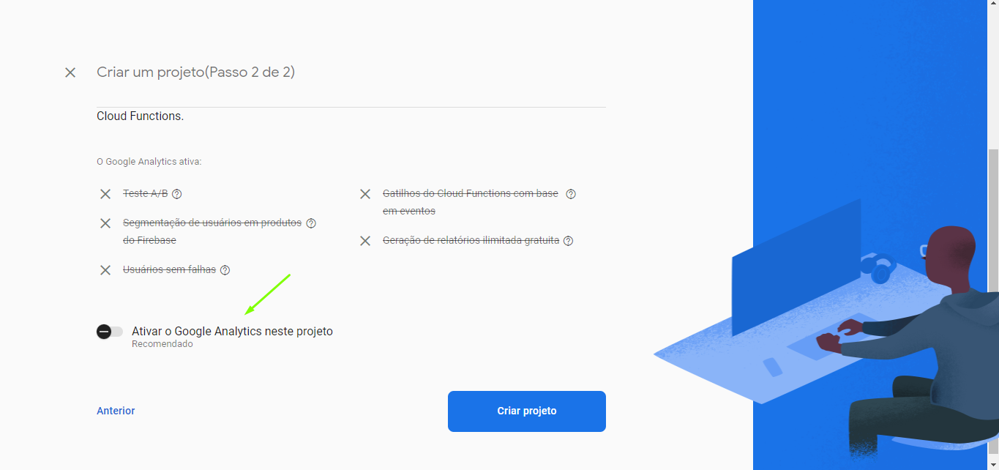
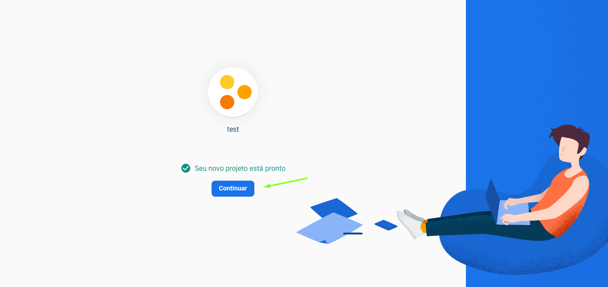
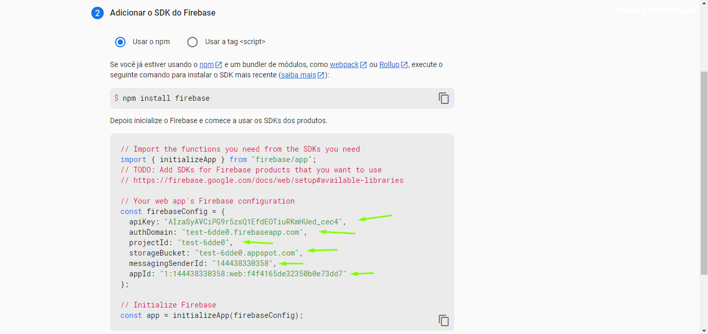

  

# My Finances

O My Finances é um sistema desenvolvido para que você tenha um melhor controle sobre as suas finanças. Conta com uma interface intuitiva e simples de utilizar.

## Tecnologias

As seguintes tecnologias foram usadas na construção do projeto:

- [React](https://react.dev/)
- [TypeScript](https://www.typescriptlang.org/)
- [Firebase](https://firebase.google.com/?hl=pt)

## Pré-requisitos

Antes de começar, você vai precisar ter instalado em sua máquina as seguintes ferramentas:

- [Git](https://git-scm.com)
- [Node.js](https://nodejs.org/en/)
- [Npm](https://www.npmjs.com/) ou [Yarn](https://yarnpkg.com/)
- Uma IDE, como o [VSCode](https://code.visualstudio.com/)

## Passo a passo

Pelo terminal:

- Faça o clone do projeto em algum local da sua máquina. Exemplo: `user/projetos`
- Vá até a pasta que você acabou de clonar. Exemplo: `cd user/projetos/my-finances`
- Utilizando **npm** ou **yarn**, instale as dependências do projeto. Exemplo: execute o comando `yarn` ou `npm i`

## Configurando o banco de dados

- Crie sua conta gratuitamente no Firebase: <link>https://firebase.google.com/?hl=pt<link> e siga o passo a passo nas imagens a seguir:

 
 
 
 
 
 
 

## Variáveis de Ambiente - ENVS

- Copie o arquivo .env.exemple presente na pasta `configs`, cole na pasta `src`, renomeie para .env e substitua as informaçãoes depois de cada "=" conforme as envs que estão na configuração do projeto no Firebase (imagem acima).

## Agora, basta executar `yarn start` ou `npm start` e o projeto vai iniciar o sistema no seu navegador.
